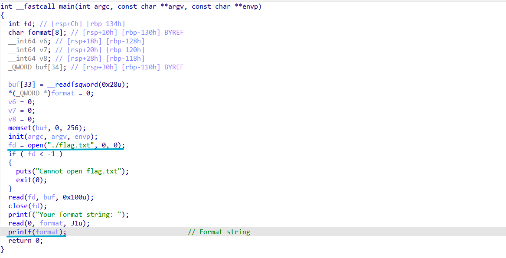
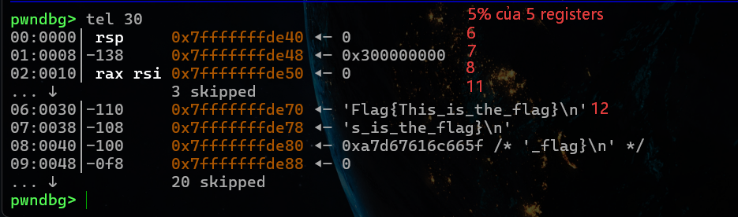

# FORMAT STRING
Lỗ hổng Format String xuất hiện khi hàm in ấn (như printf) nhận chuỗi định dạng trực tiếp từ đầu vào người dùng mà không qua kiểm tra.
## Các dịnh dạng phổ biến:
`%p` - In ra giá trị dưới dạng địa chỉ con trỏ (Hexadecimal) có tiền tố `0x`.

`%x` - In ra số nguyên 32-bit (unsigned int) dạng Hexadecimal.

`%lx` - In ra số nguyên 64-bit (unsigned long) dạng Hexadecimal.

Khác biệt với `%p` , `%x` chỉ in giá trị số đơn thuần (ví dụ ff), còn `%p` sẽ tự động đệm đủ độ dài con trỏ và thêm `0x` ở đầu (ví dụ 0x000000ff).

`%d` - In ra số nguyên có dấu (Signed Integer) dạng hệ 10.

`%u` - In ra số nguyên không dấu (Unsigned Integer) dạng hệ 10.

`%c` - In ra 1 ký tự duy nhất dựa trên mã ASCII.

`%s` - In ra chuỗi ký tự cho tới khi gặp byte Null (\x00).

`%n` - Không in ra dữ liệu, mà thực hiện ghi số lượng byte đã được in ra trước nó vào địa chỉ biến được truyền vào.

    char name[] = "Alice"; // Chuỗi "Alice" có độ dài 5 bytes
    int count = 0;

    // printf in chuỗi "Hello " (6 bytes) + chuỗi name (5 bytes) = 11 bytes
    printf("Hello %s%n\n", name, &count);

    printf("So byte đã in trước %%n là: %d\n", count); 
    // Kết quả in ra: 11

`%hn` - Ghi giá trị 2 bytes (short int).

`%n` - Ghi giá trị 1 byte (unsigned char).

## Cơ chế printf trên hệ thống 32-bit, 64-bit:

32-bit: In dữ liệu trên Stack

64-bit: 5% đầu là 5 thanh ghi (Registers) theo thứ tự: RSI, RDX, R10, R8, R9 (do RDI chứa chính chuỗi printf). % thứ 6 là dữ liệu trên Stack.

## Leak memory

Leak dữ liệu trên Stack (`%p`): Truyền nhiều `%p` (hoặc dùng dạng rút gọn như `%8$p`) để đọc các địa chỉ/giá trị đang lưu trên Stack.

Leak dữ liệu tại địa chỉ Stack (`%s`): Dùng `%s` trỏ tới vị trí chứa địa chỉ hợp lệ để đọc chuỗi ký tự tại địa chỉ mong muốn.

## Ghi đè dữ liệu

Dùng `%n` để ghi đè giá trị vào bộ nhớ: 

`%n` đếm tổng số ký tự/byte đã in ra màn hình trước đó để ghi số đó vào địa chỉ đích.

Padding bằng `%c`: Dùng định dạng độ rộng như `%28c` để ghi đè đúng số 28 vào.

Short form: `%28c%8$n` tức in ra 28 byte (`%28c`), sau đó lấy giá trị 28 đó ghi vào địa chỉ nằm ở vị trí thứ 8 trên Stack (`%8$n`)

# LEAK DỮ LIỆU BẰNG %p

File flag.txt đã mở sẵn và được lưu trên Stack. Trong chương trình cón có lỗ hổng format string, chỉ cần đưa %p vào biến format là có thể đọc dữ liệu trên Stack.

Chuỗi flag được lưu ở Stack có thể được truy cập từ % thứ 12.
