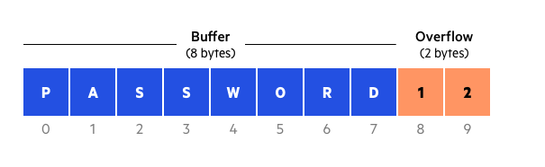
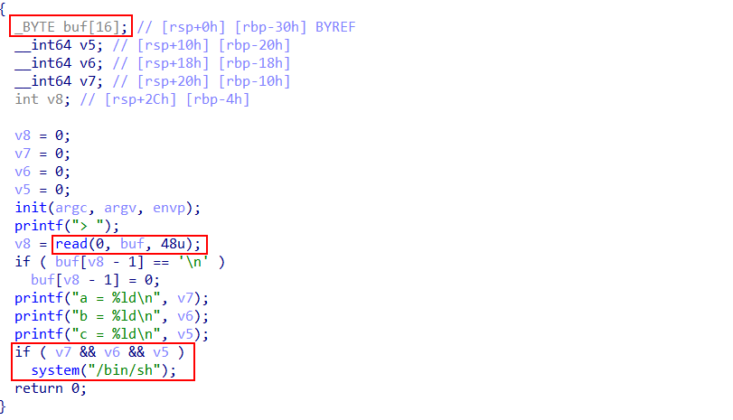
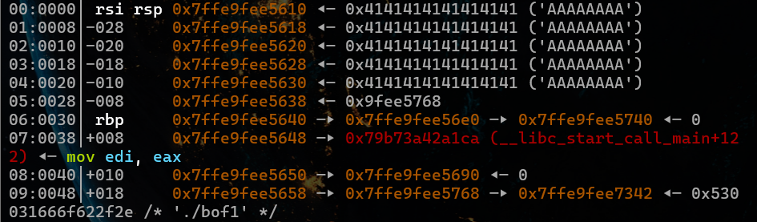
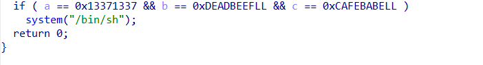
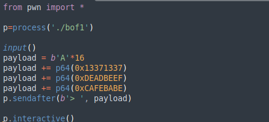
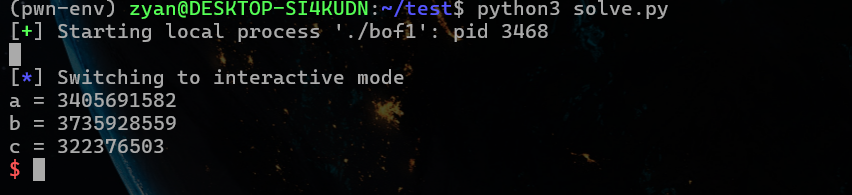

# BUFFER OVERFLOW
## Khái niệm
Buffer Overflow là kĩ thuật làm tràn bộ nhớ bằng cách nhập số BYTE dữ liệu nhiều hơn dung lượng của ô nhớ buffer khiến cho dữ liệu bị ghi đè xuống các ô nhớ khác. Từ đó những người khai thác lỗ hổng có thể ghi đè câu lệnh để chiếm quyền điều khiển hay ép chương trình hoạt động theo mong muốn của họ.

# Ví dụ (bof1)

Chương trình trên có thể cung cấp cho ta quyền điều khiển shell nếu các biến v5 v6 v7 khác 0. Tuy nhiên chương trình chỉ có thể nhập dữ liệu vào buffer nên ta không thể truy cập v5 v6 v7 theo cách thông thường. Nhưng chương trình này có một lỗ hổng có thể khai thác đó là buffer chỉ có thể chứa 16 BYTE. Trong khi đó lệnh read lại đọc tối đa đến 48 BYTE. Nếu nhập quá dữ liệu của buffer thì từ đó ta có thể ghi đè dữ liệu vào v5 v6 v7 bên dưới.

Sau khi nhập 40 kí tự A thì dữ liệu đã được ghi đè vào các ô bên dưới buffer (v5 v6 v7) và thỏa điều kiện.
Nhờ đó ta có quyền truy cập shell.

# Pwntool (bof2)

Tương tự ở bof1, ta phải ghi đè giá trị vào các biến a b c để lấy quyền điều khiển shell. Nhưng ở chương trình này giá trị phải khớp với điều kiện trong if. Tuy nhiên, trong asm dữ liệu nhập từ bàn phím sẽ bị chuyển thành mã ascii làm lưu trữ sai dữ liệu. 

pwntool có thể giúp nhập trực tiếp BYTE thô vào chương trình để đảm bảo dữ liệu được nhập đúng định dạng và kích thước BYTE phù hợp. Giả dụ khi nhập payload += p64(0x13371337) thì dữ liệu sẽ được lưu vào ô nhớ là 0x0000000013371337. Từ đó ta có thể nhập dữ liệu đúng yêu cầu và dành quyền điều khiển shell

