# BUFFER OVERFLOW
## Khái niệm
Buffer Overflow là kĩ thuật làm tràn bộ nhớ bằng cách nhập số BYTE dữ liệu nhiều hơn dung lượng của ô nhớ buffer khiến cho dữ liệu bị ghi đè xuống các ô nhớ khác. Từ đó những người khai thác lỗ hổng có thể ghi đè câu lệnh để chiếm quyền điều khiển hay ép chương trình hoạt động theo mong muốn của họ.

# Ví dụ (bof1)

Chương trình trên có thể cung cấp cho ta quyền điều khiển shell nếu các biến v5 v6 v7 khác 0. Tuy nhiên chương trình chỉ có thể nhập dữ liệu vào buffer nên ta không thể truy cập v5 v6 v7 theo cách thông thường. Nhưng chương trình này có một lỗ hổng có thể khai thác đó là buffer chỉ có thể chứa 16 BYTE. Trong khi đó lệnh read lại đọc tối đa đến 48 BYTE. Nếu nhập quá dữ liệu của buffer thì từ đó ta có thể ghi đè dữ liệu vào v5 v6 v7 bên dưới.

Sau khi nhập 40 kí tự A thì dữ liệu đã được ghi đè vào các ô bên dưới buffer (v5 v6 v7) và thỏa điều kiện.
Nhờ đó ta có quyền truy cập shell.

# Pwntool (bof2)

Tương tự ở bof1, ta phải ghi đè giá trị vào các biến a b c để lấy quyền điều khiển shell. Nhưng ở chương trình này giá trị phải khớp với điều kiện trong if. Tuy nhiên, trong asm dữ liệu nhập từ bàn phím sẽ bị chuyển thành mã ascii làm lưu trữ sai dữ liệu. 

pwntool có thể giúp nhập trực tiếp BYTE thô vào chương trình để đảm bảo dữ liệu được nhập đúng định dạng và kích thước BYTE phù hợp. Giả dụ khi nhập `payload += p64(0x13371337)` thì dữ liệu sẽ được lưu vào ô nhớ là 0x0000000013371337. Từ đó ta có thể nhập dữ liệu đúng yêu cầu và dành quyền điều khiển shell.

# Ret2Win (bof3)
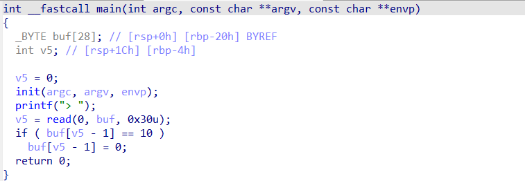
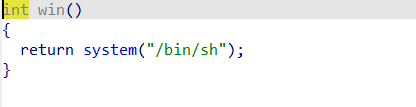

Lệnh tạo shell lần này được để đặt ở hàm win. Vì hàm main không có lệnh nào gọi hàm win nên ta phải truy cập bằng cách khác.
Ta có thể tận dụng lệnh read để ghi đè địa chỉ của hàm win vào stack nơi chứa địa chỉ return (RIP). Từ đó truy cập được hàm win dể tạo shell.
Đây gọi là kĩ thuật Ret2Win

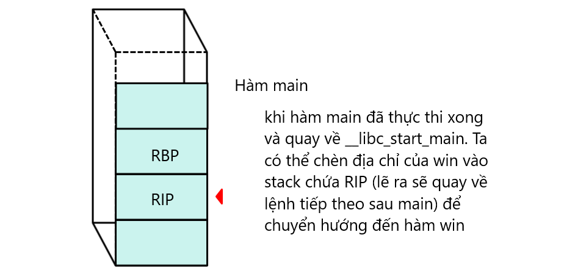

Trong pwntool, ta có thể dùng lệnh `exe=ELF('./bof3')` để phân tích cấu trúc file ELF. Bằng cách này ta có thể dùng lệnh `exe.sym['win']` để nạp địa chỉ hàm win tự động mà không cần tìm thủ công.

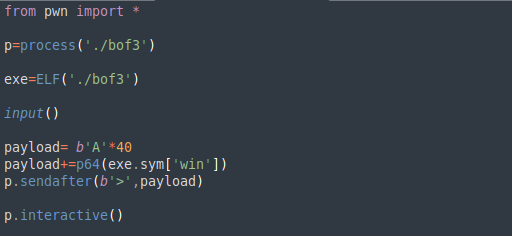

Tuy nhiên có một vấn đề nhỏ. Thông thường khi ta dùng call win thì địa chỉ trả về lệnh tiếp theo (RIP) sẽ được đẩy vào stack (8 BYTE). Sau đó, khi vào hàm win sẽ push thêm RBP của hàm cha vào stack (8 BYTE). Tổng là 16 BYTE. Đúng yêu cầu của thanh ghi xmm0: địa chỉ stack phải chia hết cho 16.
Mà khi sử dụng ret2win để truy cập hàm win thì địa chỉ trả về (RIP) không được push vào stack. Điều này dẫn tới việc push RBP vào hàm sẽ làm stack chỉ tăng lên tổng là 8 BYTE. Khi địa chỉ stack không chia hết cho 16 thì lệnh `movaps xmmword ptr [rsp + 0x50], xmm0` lập tức làm chương trình bị crash (SIGSEGV).

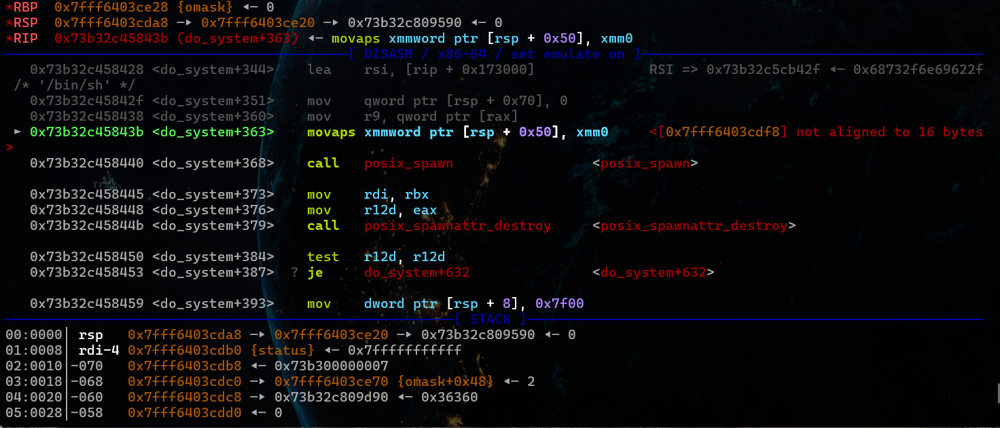

Một cách đơn giản để khắc phục điều này là ret2win vào địa chỉ bỏ qua lệnh push RBP. Từ đó có thể tạo shell mà không bị lỗi.

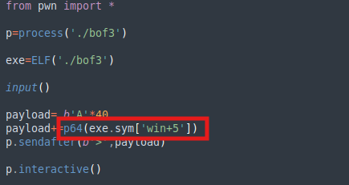

# ROPchain (bof4)
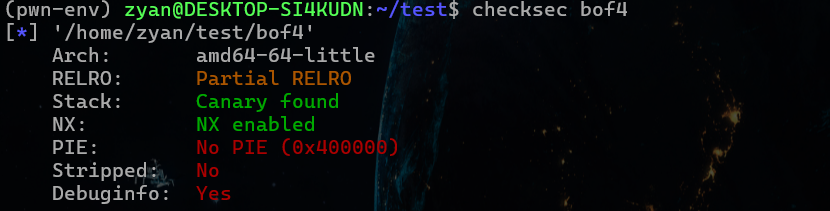

Trong bof4 lần này không có hàm win chứa lệnh gọi shell để dùng ret2win, cũng như không thể tạo shell từ main.
Do đó, ta cần cách khác là dùng lệnh execve qua syscall để tạo shell. Nhưng file bof4 đã bật cơ chế bảo mật NX, về cơ bản chặn việc thực thi tại vùng nhớ stack. Thế nên khi ghi đè lệnh execve lên stack rồi gọi ret lên địa chỉ đó sẽ báo lỗi.
Dù vậy, chương trình vẫn thực thi các lệnh trên vùng .text nên ta có thể tận dụng những câu lệnh có sẵn trong đó để gọi lệnh execve. Đây là kĩ thuật ROPchain.

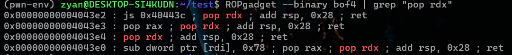

Một hay vài câu lệnh thao tác dữ liệu kèm theo lệnh chuyển hướng sau cùng được gọi là các Gadget. Các Gadget có thể được tìm kiếm bằng lệnh `ROPgadget --binary bof4`. Tùy vào mục đích sử dụng mà ta có thể tìm kiếm các gadget có đặc điểm cụ thể.

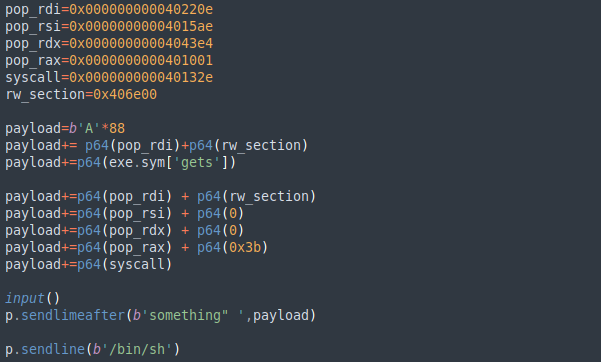

Ta cần ghi đè địa chỉ của các gadget vào stack để khi gặp lệnh chuyển hướng sẽ kích hoạt chuỗi các gadget nối đuôi nhau. Từ đó thực hiện câu lệnh theo ý muốn và gọi lệnh syscall execve chạy '/bin/sh' để tạo shell.

Luồng thực thi khi kích hoạt ROPchain sẽ như sau:

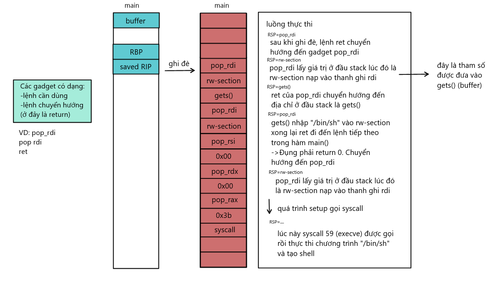 

# Ret2Shellcode No Leak (bof5)

Shellcode là các đoạn mã máy được dùng để nạp vào vùng nhớ (thông thường là stack) thông qua buffer oveflow để chạy trực tiếp /bin/sh trên vùng nhớ đó.

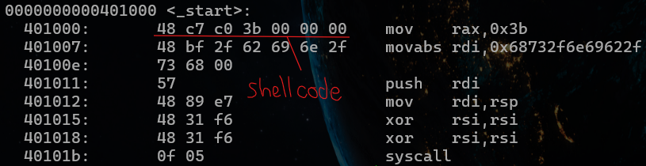 

Ret2shellcode sẽ sử dụng 1 lệnh chuyển hướng để nhảy đến vùng nhớ chứa shellcode và thực thi. Kĩ thuật này nhanh và đơn giản hơn xây dựng ROPchain. Nhưng đồng thời cũng bị hạn chế bởi cơ chế bảo mật NX có thể chặn quyền thực thi trên stack.

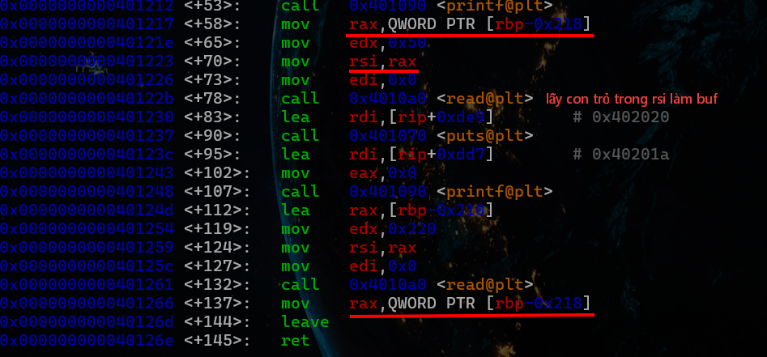

Chúng ta đã có sẵn con trỏ đến shellcode ở thanh ghi rax. Việc còn lại chỉ cần chuyển hướng tới địa chỉ trong rax qua lệnh call hay jmp rax để thực thi shellcode.

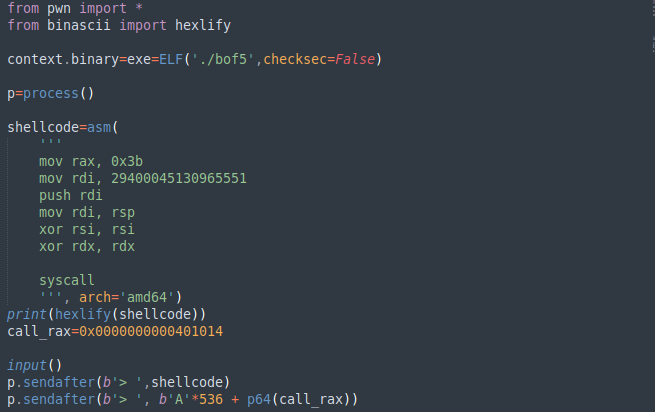

Dùng lệnh asm để chuyển từ code Assembly qua shellcode rồi ghi vào buffer. Sau đó ghi đè địa chỉ của gadget call rax vào saved RIP để chuyển hướng khi ret. Shellcode sau đó sẽ được thực thi và tạo shell

# Ret2shellcode Leak Required (bof6)

Khi ta hoàn toàn mù tịt về địa chỉ stack chứa shellcode để nhảy tới, cũng như không có sẵn con trỏ đến buffer thì leak một địa chỉ stack là cần thiết. Từ đó có thể tính toán offset hay ghi shellcode lên chính địa chỉ đó để thực thi.

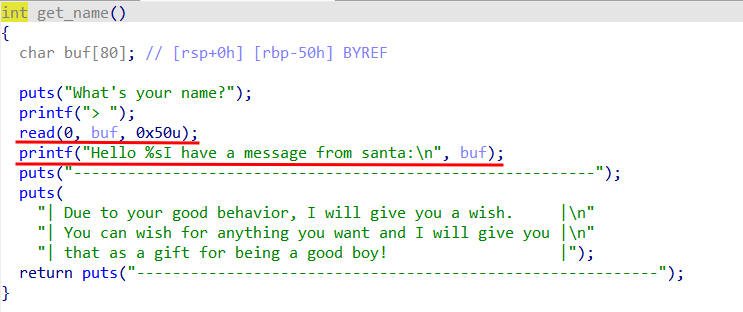

Trong bài này ta sẽ leak một địa chỉ stack thông qua việc để cho chương trình in ra địa chỉ đó. Để làm được điều đó ta cần xem lại cơ chế hàm read, khi nhập xong sẽ không tự động thêm ngắt chuỗi. Do đó khi nhập vừa đủ kí tự để qua ô nhớ bên dưới thì địa chỉ bên dưới sẽ bị nối vào chuỗi. 

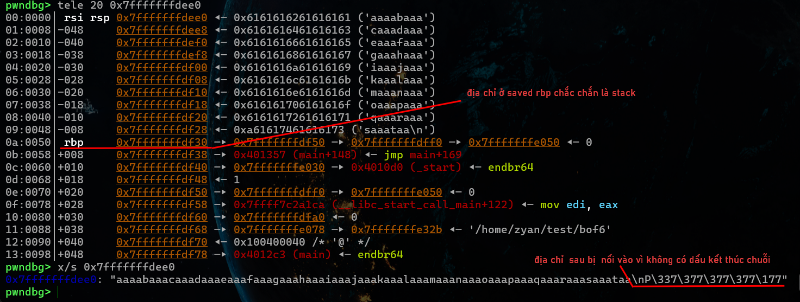

Lệnh p.recvuntil() sẽ chờ đến sau đoạn dữ liệu này mới nhận.
